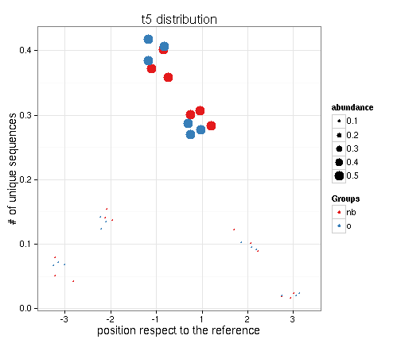
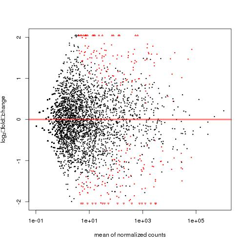
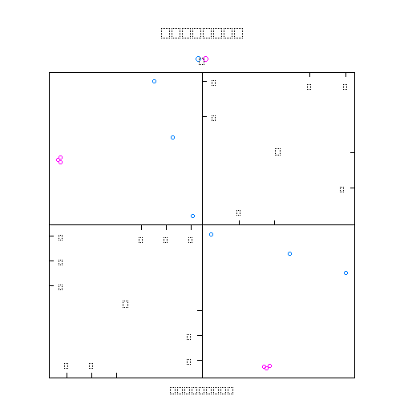

<!--
%\VignetteEngine{knitr::knitr}
%\VignetteIndexEntry{An Introduction to the IsomiR package}
-->

Example of isomiRs function 

========================================================

We are going to use a small RNAseq data coming from human frontal cortex samples to give some basic examples of isomiRs analyses. There are two groups: b) individuals with less than a year, o) individuals in the eldery.


```r
library(isomiRs)
```

```
## Loading required package: DiscriMiner
## Loading required package: lattice
## Loading required package: DESeq2
## Loading required package: GenomicRanges
## Loading required package: BiocGenerics
## Loading required package: parallel
## 
## Attaching package: 'BiocGenerics'
## 
## The following objects are masked from 'package:parallel':
## 
##     clusterApply, clusterApplyLB, clusterCall, clusterEvalQ,
##     clusterExport, clusterMap, parApply, parCapply, parLapply,
##     parLapplyLB, parRapply, parSapply, parSapplyLB
## 
## The following object is masked from 'package:stats':
## 
##     xtabs
## 
## The following objects are masked from 'package:base':
## 
##     anyDuplicated, append, as.data.frame, as.vector, cbind,
##     colnames, duplicated, eval, evalq, Filter, Find, get,
##     intersect, is.unsorted, lapply, Map, mapply, match, mget,
##     order, paste, pmax, pmax.int, pmin, pmin.int, Position, rank,
##     rbind, Reduce, rep.int, rownames, sapply, setdiff, sort,
##     table, tapply, union, unique, unlist
## 
## Loading required package: IRanges
## Loading required package: XVector
## Loading required package: Rcpp
## Loading required package: RcppArmadillo
## KernSmooth 2.23 loaded
## Copyright M. P. Wand 1997-2009
```

```r
data(isomiRex)
```


You can plot isomiRs tendencies with `plotIso`


```r
#check plot iso
obj<-plotIso(obj,type="t5")
```

```
## [1] "nb1"
## [1] "nb2"
## [1] "nb3"
## [1] "o1"
## [1] "o2"
## [1] "o3"
```

 


Do differential expression analysis using DESeq2


```r
dds<-deIso(obj,formula=~condition,ref=TRUE,iso5=T)
```

```
## [1] "doing"
## [1] "nb1"
## [1] "nb2"
## [1] "nb3"
## [1] "o1"
## [1] "o2"
## [1] "o3"
```

```r
#plotMA
library(DESeq2)
plotMA(dds)
```

 


Let's do a PLS model having in the count matrix the reference miRNA, and all isomiRs for each miRNA.


```r
obj<-makeCounts(obj,ref=T)
```

```
## [1] "nb1"
## [1] "nb2"
## [1] "nb3"
## [1] "o1"
## [1] "o2"
## [1] "o3"
```

```r
obj<-normIso(obj)
pls.obj<-isoPLSDA(obj,"condition")
isoPLSDAplot(pls.obj$component,obj@design[,"condition"])
```

 


You can do the analysis just with features that are important for the model


```r
pls.obj<-isoPLSDA(obj,"condition",refinment=TRUE)
```

