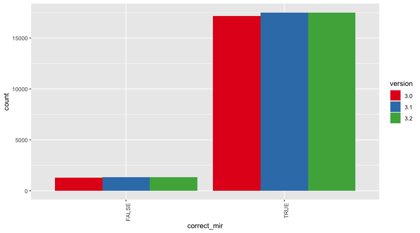
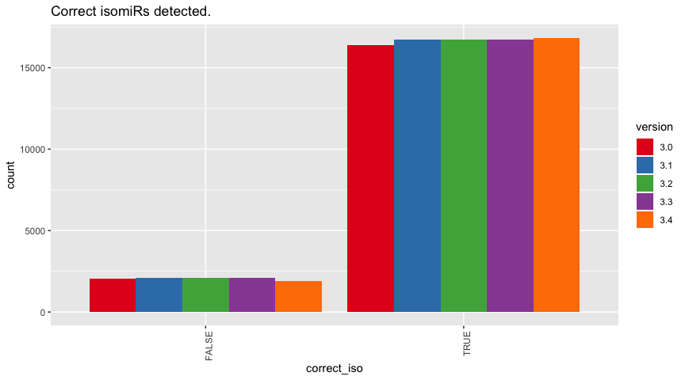
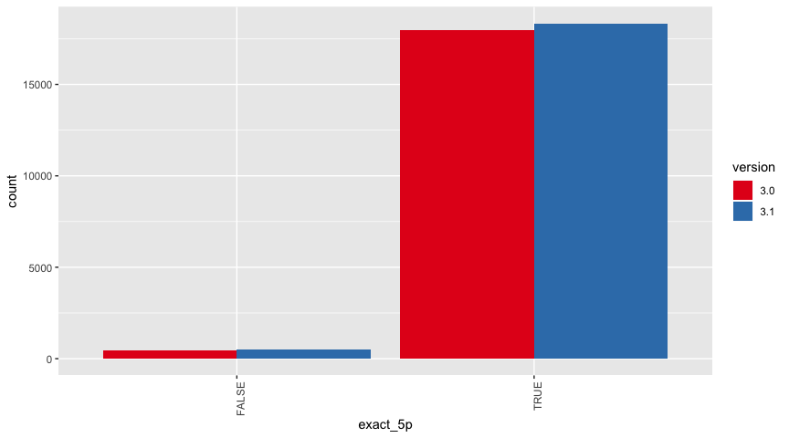
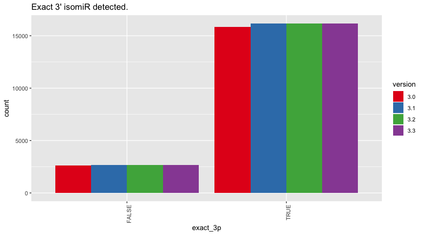

``` r
library(tidyverse)

parsing = . %>% separate(name, c("fasta", "mature", "position", "trimming", 
    "mut", "ext", "counts"), sep = "_") %>% separate(trimming, c("iso5p", "iso3p"), 
    sep = ":") %>% mutate(correct_mir = mir == mature, correct_add = (ext != 
    "add:null" & add != "0") | (ext == "add:null" & add == "0"), correct_change = (mut != 
    "mut:null" & mism != "0") | (mut == "mut:null" & mism == "0"), correct_5p = (iso5p != 
    "0" & t5 != "0") | (iso5p == "0" & t5 == "0"), correct_3p = (iso3p != "0" & 
    t3 != "0") | (iso3p == "0" & t3 == "0"), correct_iso = correct_add & correct_change & 
    correct_5p & correct_3p, num_5p = ifelse(grepl("[ATGC]", t5), -1 * nchar(t5), 
    0), num_5p = ifelse(grepl("[atcg]", t5), nchar(t5), num_5p), num_3p = ifelse(grepl("[ATGC]", 
    t3), nchar(t3), 0), num_3p = ifelse(grepl("[atcg]", t3), -1 * nchar(t3), 
    num_3p))

data34 <- read.table("sim.21.hsa.3.4.mirna", header = T, stringsAsFactors = F) %>% 
    parsing()

data33 <- read.table("sim.21.hsa.3.3.mirna", header = T, stringsAsFactors = F) %>% 
    parsing()

data32 <- read.table("sim.21.hsa.3.2.mirna", header = T, stringsAsFactors = F) %>% 
    parsing()

data31 <- read.table("sim.21.hsa.3.1.mirna", header = T, stringsAsFactors = F) %>% 
    parsing()

data3 <- read.table("sim.21.hsa.3.0.mirna", header = T, stringsAsFactors = F) %>% 
    parsing()

data <- bind_rows(data3 %>% mutate(version = "3.0"), data31 %>% mutate(version = "3.1"), 
    data32 %>% mutate(version = "3.2"), data33 %>% mutate(version = "3.3"), 
    data34 %>% mutate(version = "3.4"))
```

# Overview

I simulated a bunch of isomirs that can have the following variation:

  - starts at different position than the reference miRNA: t5
  - ends at different position than the reference miRNA: t3
  - have a mutation: muts
  - have nt addition at the end: add

# Detection

Correct miRNA annotation for miraligner.

``` r
library(ggplot2)
ggplot(data, aes(correct_mir, fill = version)) + geom_bar(position = "dodge") + 
    scale_fill_brewer(palette = "Set1") + theme(axis.text.x = element_text(angle = 90, 
    hjust = 1))
```

<!-- -->

# Accuracy

  - `correct_iso` is True when the isomiRs is annotated to the correct
    miRNA and detecting all the possible variants.

  - `exact_5p` is True when the exact same nucleotides of the 5’ end of
    the isomiRs are being detected.

  - `exact_3p` is True when the exact same nucleotides of the 3’ end of
    the isomiRs are being
detected.

<!-- end list -->

``` r
ggplot(data, aes(correct_iso, fill = version)) + geom_bar(position = "dodge") + 
    scale_fill_brewer(palette = "Set1") + theme(axis.text.x = element_text(angle = 90, 
    hjust = 1)) + ggtitle("Correct isomiRs detected.")
```

<!-- -->

``` r
mutate(data, exact_5p = num_5p == iso5p) %>% ggplot(aes(exact_5p, fill = version)) + 
    geom_bar(position = "dodge") + scale_fill_brewer(palette = "Set1") + theme(axis.text.x = element_text(angle = 90, 
    hjust = 1)) + ggtitle("Exact 5' isomiR detected. ")
```

<!-- -->

``` r
mutate(data, exact_3p = num_3p == iso3p) %>% # filter(ext == 'add:null') %>%
ggplot(aes(exact_3p, fill = version)) + geom_bar(position = "dodge") + scale_fill_brewer(palette = "Set1") + 
    theme(axis.text.x = element_text(angle = 90, hjust = 1)) + ggtitle("Exact 3' isomiR detected. ")
```

<!-- -->
